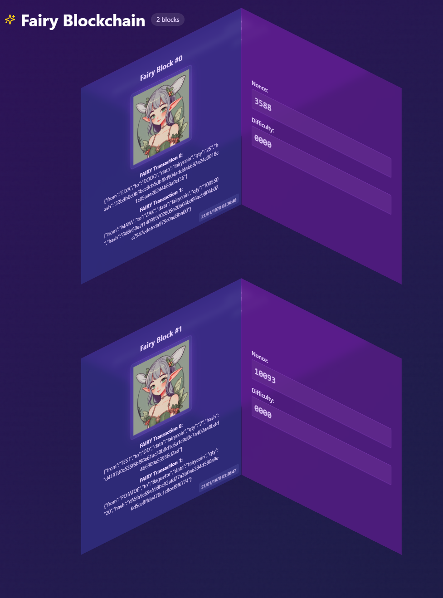

# FAIRYCHAIN aka BlockChain for Fairies

## Introduction
This is not a serious project, just making this for fun to learn about more web3 technologies.
I have worked a bit with NFTs and smart contracts, but I want to learn more about how to build a blockchain from scratch.

# Blockchain API features:
- [x] Create a transaction /transaction
- [x] Check blockchain validity /validate
- [x] Check blockchain content /fairychain
- [x] Get latest block information /latest_block

# Goals
- [x] Create a simple blockchain (POW, Validation methods)
- [x] Create a simple transaction pool
- [x] Auto-mining after 2 transactions

